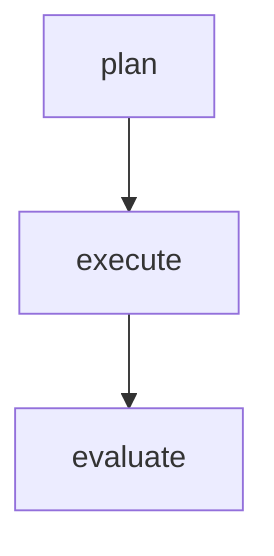

# organization
- v source files within a directory will be contained in a same module
- reusing var/type/func between module has to be previously exported using `pub`
- reusing var/type/func between files in a module doesn't need to be exported
# structure
- program entry point using `fn main()`, like `c` or `go`
- simple script/program doesn't need to declare `module` or even `fn main`
# flow
# language elements
## variables
## types
### intro
### numbers
### strings
### arrays
### sumtypes
